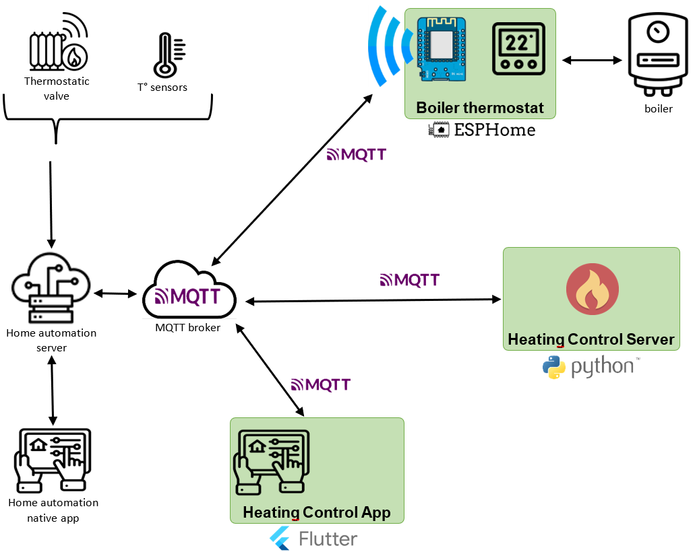

# Heating Control Server
#### A server to control your heating with daily schedules, written in python 3

<p align="middle">
	
</p>

##

This python program is the server part of the "heating control project".
It gathers the states of all declared thermostat devices, and controls their setpoint by applying user defined schedules.

It can be deployed in several ways :
- As a stand alone server, on an arbitrary PC or Raspberry Pi for example. In this case, the devices must be accessible (for getting and settings states) on a MQQT broker. One solution may be a Zigbee2MQTT gateway for example, or a domotic server like Home Assistant.
- As a [Home Assistant] integration. In this case, the mosquito MQTT broker add-on of HA can be used.

For a complete installation guide, go to installation section.

This project has other repositories :
- A mobile and desktop client to define schedules and supervise devices : [flutter_heating_control_app]
- I also connected my boiler (a Frisquet model) to the network, to make the server control it as any heating thermostat : [frisquet_boiler_thermostat]

## Project Architecture
<p align="middle">
	
</p>
> This image uses resources from flaticon.com

## Features
The server is able to :
- Send planned temperatures in the current active schedule to each device, when needed
- Keep the configuration file up to date (schedules, temperature sets, ...)
- Handle the client interface :
	- send notification on any configuration data change
	- receive and execute commands from a connected client (new setpoint, new schedule, ...)
	- control of consistency on any configuration data change request
- Setpoint auto-replay (when a device fails to apply a new setpoint)
- Integrate in Home Assistant
- Send logs to file for debug purpose

## TODO
- Make a install script for Home Assistant
- Make the mqtt connection work both with websocket and raw tcp
- Add comments in code !
- Add auto-tests

## Installation inside Home Assistant
This section only covers the case of server installation as a Home Assistant integration. As a consequence, the prerequisite is a running HA instance that contains a few thermostat entities.

#### 1- MQTT Broker
The server needs a MQTT broker instance to connect to. To activate Mosquitto broker inside HA, do the following :
- Install the mosquitto broker add-on from the add-ons section of HA parameters
- Declare the user 'mqtt' (or any other!) in HA settings and choose his password wisely
> Detailed instructions can be found online...

#### 3- Installation of the add-on
To install the server as a add-on (custom component) on your Home Assistant instance, the easier way is to use the install script. Please go to [HA_integration folder](./HA_integration/) and take a look at the README file

## Standalone Installation
TBD

#### 1- Install third-party python libraries
```sh
pip install paho-mqtt
pip install pyyaml
```

#### 2- Server configuration file
The configuration file to update is located here : `./heating_ctrl_default_configuration.yaml`

> **Note :**
> - To understand the meaning of each parameter in the configuration file, read the file `./documented_configuration.yaml`
> - This file will never be overwritten by the server. When the running server change the configuration file content, for example after the reception of a new schedule from the mobile app, it saves the new configuration in an other file named `« heating_ctrl_configuration.yaml »`

You just have to update the MQTT parameters in « protocols/mqtt » section :
  ```yaml
  protocols:
    mqtt:
    - name:   "mqtt_ha"
      user:   "mqtt"             #<-- put your mqtt user name here
      pwd:    "gfkjGHT8sx_"      #<-- put your mqtt password here
      broker: "myha.duckdns.org" #<-- put your HA instance hostname or IP address here
      port:   8884               #<-- put your (websocket) mqtt secure port here
      ssl:    true
  ```

## Tech and dependencies
This software uses a number of tech and projects to work properly:
- [Python 3] - Required version is 3.7+
- [MQTT] - The Standard for IoT Messaging

And it depends on following python 3 libraries :
- [paho-mqtt] -  Eclipse Paho MQTT Python client library
- [PyYAML] - PyYAML is a YAML parser and emitter for Python


## Server Architecture
The following figure shows the internal architecture of the server software :
<p align="middle">
	
</p>

## Other
This README has been written using [Dillinger]

[//]: # (These are reference links used in the body of this note and get stripped out when the markdown processor does its job. There is no need to format nicely because it shouldn't be seen. Thanks SO - http://stackoverflow.com/questions/4823468/store-comments-in-markdown-syntax)

  [flutter_heating_control_app]: <https://github.com/celariss/flutter_heating_control_app/>
  [frisquet_boiler_thermostat]: <https://github.com/celariss/frisquet_boiler_thermostat/>
  [python 3]: <https://www.python.org/about/>
  [mqtt]: <https://mqtt.org/>
  [home assistant]: <https://www.home-assistant.io/>
  [paho-mqtt]: <https://pypi.org/project/paho-mqtt/>
  [pyyaml]: <https://pyyaml.org/wiki/PyYAMLDocumentation>
  [dillinger]: <https://dillinger.io/>
  